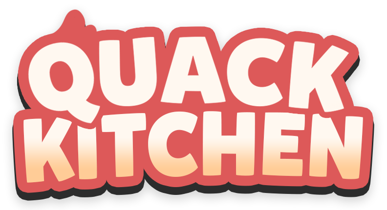

# Quack Kitchen



Quack Kitchen is a single-player 2D cooking game built by the DigiDucks team
at DigiPen Institute of Technology Singapore. Take orders, prepare each dish,
and keep a growing line of customers happy before the day ends.

The game and its custom C++ engine use OpenGL, GLFW, GLEW, FreeType, and FMOD.
The current release target is **1.0.0** for Windows and Linux.

## Play

- Move with `WASD`, the left analog stick, or the directional pad.
- Pick up or place an item with `J` / gamepad `X`.
- Use a station with `K` / gamepad `A`.
- Pause with `Esc` / gamepad `Start`.
- Toggle fullscreen with `Alt+Enter`.

The in-game How to Play pages and tutorial automatically switch between
keyboard and gamepad instructions when a controller is connected.

## Download

The release workflow produces three installable packages:

- `Quack_Kitchen_1.0.0_Setup.exe` — Windows 10/11 installer.
- `Quack_Kitchen-1.0.0-x86_64.AppImage` — portable Linux application.
- `Quack_Kitchen-1.0.0-x86_64.flatpak` — Linux Flatpak bundle.

Published builds will be available from the repository's GitHub Releases page.

## Build from source

Clone the repository normally. CMake 3.21 or newer and a C++17 compiler are
required.

### Linux

On Ubuntu, install the native build dependencies:

```sh
sudo apt-get install cmake g++ libfreetype-dev libglew-dev libglfw3-dev ninja-build
```

Then configure, build, and test the Release preset:

```sh
cmake --preset linux-release
cmake --build --preset linux-release --parallel
ctest --test-dir Build/linux-release --output-on-failure
```

Run the staged build directly:

```sh
"Build/linux-release/Project/DuckEngine/Quack Kitchen"
```

To create an AppImage, install ImageMagick and provide a `linuxdeploy`
executable:

```sh
LINUXDEPLOY=/path/to/linuxdeploy-x86_64.AppImage tools/package_linux.sh
```

### Windows

Install Visual Studio 2022 with the Desktop development with C++ workload,
CMake, Ninja, and vcpkg. Bootstrap vcpkg and expose its directory as
`VCPKG_ROOT`, then run these commands from a Developer PowerShell:

```powershell
cmake --preset windows-release
cmake --build --preset windows-release --parallel
ctest --test-dir Build/windows-release --output-on-failure
```

The executable is generated at
`Build\windows-release\Project\DuckEngine\Quack Kitchen.exe`.

The original Visual Studio solution remains at
`Project/DuckEngine/DuckEngine.sln` for legacy development. CMake is the
supported path for reproducible release builds.

## Packaging and verification

- `tools/validate_assets.py` checks serialized and source-code asset paths,
  including case-sensitive Linux paths.
- `tools/verify_release.py` checks staged Windows/Linux runtime contents,
  licensing files, development-file exclusions, and the 500 MiB installed-size
  limit.
- `Installer/InstallScript.iss` defines the DigiPen-style Inno Setup package.
- `packaging/linux/` contains the AppImage launch files and Flatpak manifest.
- `.github/workflows/ci.yml` builds, tests, stages, verifies, and smoke-tests
  both supported operating systems.
- `.github/workflows/release.yml` builds all three release packages on every
  `main` push. A manual run can also publish them under a requested version
  tag after the package jobs pass.

## Repository layout

```text
Project/DuckEngine/
├── Engine/       Custom engine source and bundled SDK files
├── Game/         Quack Kitchen gameplay source
└── Resources/    Runtime scenes, sprites, audio, fonts, and shaders
Installer/        Windows installer definition
packaging/        Linux and Windows packaging metadata
tools/            Asset, release, and packaging checks
Licenses/         Third-party notices and shipped-asset provenance
```

The editor is intentionally outside the 1.0.0 release scope and is retained as
a possible future project.

## Licenses and attribution

Quack Kitchen is a DigiPen student project. Third-party software, font, and
asset notices are documented in [`Licenses/`](Licenses/README.md), with the
runtime media audit in
[`Licenses/ASSET_PROVENANCE.md`](Licenses/ASSET_PROVENANCE.md).
